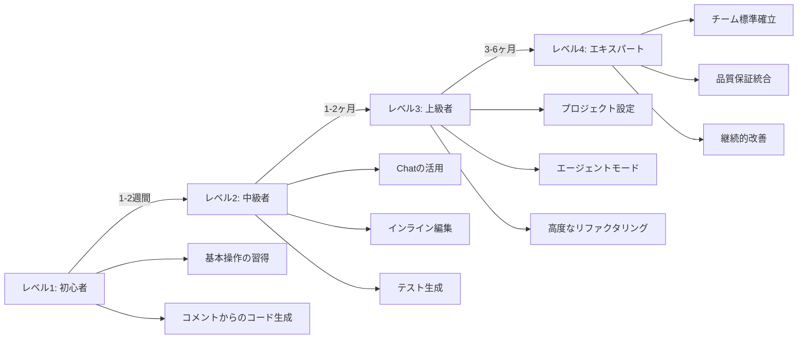

# GitHub Copilot活用チェックリスト（C#版）
## 〜現場ですぐに使える運用マニュアル〜

## 📋 チェックリストの使い方

このチェックリストは、C#開発におけるGitHub Copilotの活用状況を確認するためのものです。各項目をチェックしながら、チームや個人の習熟度を把握し、段階的に活用レベルを向上させることができます。

---

# レベル1：初心者向けチェックリスト

## ✅ 基本操作の習得

### コード補完の基本
- [ ] `Enter`キーで提案を受け入れられる
- [ ] `Tab`キーで部分的な提案を受け入れられる
- [ ] `Esc`キーで提案をキャンセルできる
- [ ] `Alt + ]`（または`Alt + [`）で次の/前の提案を表示できる
- [ ] 提案が表示されない場合、少し待つかコードを書き進められる

### コメントからのコード生成
- [ ] 日本語でコメントを書くとコードが生成されることを確認した
- [ ] 具体的なコメントほど正確なコードが生成されることを理解した
- [ ] `// TODO:` コメントから実装の提案を受けられる

```csharp
// チェック例：以下のコメントで適切なコードが生成されるか？
// 文字列を受け取り、各単語の先頭を大文字にする関数
```

### 簡単なリファクタリング
- [ ] 重複したコードを書いているときに、次の行の提案を受け入れられる
- [ ] 似たようなパターンのコードを連続して書ける

---

## ✅ 日常的な活用習慣

### コーディング前の準備
- [ ] ファイルを保存してからCopilotを使用している
- [ ] 適切なファイル名とクラス名をつけている
- [ ] プロジェクトのコンテキスト（ターゲットフレームワークなど）を設定している

### コード品質の確認
- [ ] 生成されたコードを理解してから受け入れている
- [ ] 生成されたコードにセキュリティ上の問題がないか確認している
- [ ] 生成されたコードがプロジェクトのコーディング規約に合っているか確認している

---

# レベル2：中級者向けチェックリスト

## ✅ Copilot Chatの活用

### 基本的な質問
- [ ] 選択したコードについて説明を求められる
- [ ] エラーメッセージの意味と解決方法を質問できる
- [ ] 特定のアルゴリズムやパターンの実装例を依頼できる

```csharp
// チェック例：以下の質問ができるか？
// 「このLINQクエリのパフォーマンスを改善する方法を教えて」
```

### リファクタリング依頼
- [ ] 選択したコードのリファクタリングを依頼できる
- [ ] 特定のデザインパターンへの適用を依頼できる
- [ ] コードの複雑さを軽減する提案を受けられる

### ドキュメント生成
- [ ] XMLコメントの自動生成を依頼できる
- [ ] READMEやAPIドキュメントの下書きを作成できる
- [ ] コードの使用方法を説明するサンプルコードを生成できる

---

## ✅ インライン編集の活用

### コード修正
- [ ] 選択範囲に対して直接修正指示を出せる
- [ ] エラーハンドリングの追加を依頼できる
- [ ] nullチェックの追加を依頼できる

```csharp
// チェック例：以下のコードを選択して「nullチェックを追加して」と指示
public string GetUserName(int userId)
{
    var user = _dbContext.Users.Find(userId);
    return user.Name;
}
```

### パフォーマンス最適化
- [ ] LINQクエリの最適化を依頼できる
- [ ] 非同期処理への変換を依頼できる
- [ ] メモリ使用量の削減提案を受けられる

---

## ✅ テストコードの生成

### ユニットテスト
- [ ] 選択したクラスのテストコードを生成できる
- [ ] xUnit/NUnitのテストケースを生成できる
- [ ] Moqを使ったモックの設定を生成できる

```csharp
// チェック例：以下のクラスを選択して「テストコードを生成して」と指示
public class Calculator
{
    public int Add(int a, int b) => a + b;
    public int Divide(int a, int b) => a / b;
}
```

### テストケースの拡充
- [ ] 境界値テストケースを追加できる
- [ ] 例外テストケースを追加できる
- [ ] パラメタライズドテストに変換できる

---

# レベル3：上級者向けチェックリスト

## ✅ プロジェクト全体の設定

### カスタム命令ファイルの作成
- [ ] `.github/copilot-instructions.md`を作成している
- [ ] プロジェクトの技術スタックを明記している
- [ ] コーディング規約を定義している
- [ ] 命名規則を定義している
- [ ] テスト方針を定義している

```markdown
# チェック例：以下の項目を定義しているか？

## 技術スタック
- .NET 8
- Entity Framework Core
- xUnit
- Moq

## コーディング規約
- ファイルスコープの名前空間を使用
- 非同期メソッドはAsyncサフィックス
- ConfigureAwait(false)をライブラリコードで使用
```

### チーム共有設定
- [ ] チーム共通の指示ファイルをGitで管理している
- [ ] 新メンバーへの共有プロセスを確立している
- [ ] 定期的に指示ファイルを見直している

---

## ✅ エージェントモードの活用

### 複数ファイル操作
- [ ] 新機能追加時に必要なファイルを自動作成できる
- [ ] リファクタリングを複数ファイルにまたがって実行できる
- [ ] マイグレーションスクリプトを生成できる

```csharp
// チェック例：以下の指示ができるか？
// 「UserエンティティにEmailConfirmedプロパティを追加して、
// 対応するマイグレーションを作成し、コントローラーとテストを更新して」
```

### アーキテクチャ設計
- [ ] クリーンアーキテクチャの構造を生成できる
- [ ] CQRSパターンの実装を生成できる
- [ ] 依存性注入の設定を自動化できる

---

## ✅ 高度なリファクタリング

### デザインパターンの適用
- [ ] リポジトリパターンへのリファクタリング
- [ ] ストラテジーパターンの適用
- [ ] ファクトリーパターンの導入
- [ ] Observerパターンの実装

### コード分析と改善
- [ ] 循環複雑度の高いコードの特定と改善
- [ ] メソッドの長さの最適化
- [ ] クラスの責務分割の提案

---

# レベル4：エキスパート/テックリード向けチェックリスト

## ✅ チーム標準の確立

### コーディング規約の定義
- [ ] チームのC#コーディング規約を`.editorconfig`で定義
- [ ] 規約に沿ったコードをCopilotが生成することを確認
- [ ] レビュー指摘事項をパターン化して共有

```xml
<!-- チェック例：.editorconfigの設定例 -->
<Project Sdk="Microsoft.NET.Sdk">
  <PropertyGroup>
    <AnalysisLevel>latest</AnalysisLevel>
    <AnalysisMode>All</AnalysisMode>
    <TreatWarningsAsErrors>true</TreatWarningsAsErrors>
  </PropertyGroup>
</Project>
```

### コードレビュープロセスの効率化
- [ ] レビュー時にCopilotで改善案を提示している
- [ ] 共通のレビュー指摘をテンプレート化している
- [ ] PRの説明文を自動生成している

---

## ✅ 品質保証プロセスの統合

### テスト自動化
- [ ] カバレッジ基準を満たすテストの自動生成
- [ ] 統合テストのシナリオ生成
- [ ] パフォーマンステストのスクリプト生成

### セキュリティチェック
- [ ] 生成されたコードのセキュリティ脆弱性チェック
- [ ] OWASP Top 10対策の確認
- [ ] 依存関係の脆弱性チェック

---

## ✅ 継続的改善

### フィードバックループ
- [ ] Copilotの提案品質をチームで評価している
- [ ] よく使うプロンプトのテンプレートを共有している
- [ ] 失敗事例を共有し、改善点を洗い出している

### メトリクス計測
- [ ] Copilotの受け入れ率を測定している
- [ ] コード生成による生産性向上を計測している
- [ ] バグ発生率の変化を追跡している

---

# プロジェクト種別別チェックリスト

## 🎯 Web APIプロジェクト

### コントローラー生成
- [ ] `[ApiController]`属性が付与されている
- [ ] ルーティングが適切に設定されている
- [ ] HTTPメソッドに対応する属性が付いている
- [ ] アクションメソッドの戻り値型が`ActionResult<T>`になっている

```csharp
// チェック例：以下のようなコントローラーが生成されるか？
[ApiController]
[Route("api/[controller]")]
public class ProductsController : ControllerBase
{
    [HttpGet]
    public async Task<ActionResult<IEnumerable<ProductDto>>> GetProducts()
    {
        // ...
    }
}
```

### バリデーション
- [ ] DataAnnotations属性が使用されている
- [ ] FluentValidationが導入されている場合は設定されている
- [ ] カスタムバリデーションルールが実装されている

### エラーハンドリング
- [ ] グローバル例外フィルターが設定されている
- [ ] 問題詳細（Problem Details）が返却される
- [ ] ログ出力が適切に設定されている

---

## 🎯 Entity Framework Coreプロジェクト

### データアクセス
- [ ] `DbContext`の設定が適切
- [ ] リポジトリパターンが適用されている（必要な場合）
- [ ] クエリに`AsNoTracking()`が適切に使用されている
- [ ] N+1クエリ問題が回避されている

```csharp
// チェック例：以下のような最適化がされているか？
var orders = await _context.Orders
    .Include(o => o.Items)
    .ThenInclude(i => i.Product)
    .Where(o => o.CustomerId == customerId)
    .AsNoTracking()
    .ToListAsync();
```

### マイグレーション
- [ ] マイグレーションスクリプトが生成できる
- [ ] シードデータの設定ができる
- [ ] インデックスが適切に設定されている

---

## 🎯 テストプロジェクト

### テスト構成
- [ ] テストプロジェクトが分離されている
- [ ] テストランナー（xUnit/NUnit）が設定されている
- [ ] モックフレームワーク（Moq）が設定されている

### テストカバレッジ
- [ ] 正常系テストがカバーされている
- [ ] 異常系テストがカバーされている
- [ ] 境界値テストがカバーされている
- [ ] エッジケースがテストされている

---

# トラブルシューティングチェックリスト

## 🚨 Copilotが反応しない場合

- [ ] インターネット接続を確認した
- [ ] GitHub Copilotのサブスクリプションが有効か確認した
- [ ] IDE/エディタを再起動した
- [ ] ファイルを保存した
- [ ] コメントをもっと具体的に書いた
- [ ] 一度ファイルを閉じて開き直した

## 🚨 不適切なコードが提案される場合

- [ ] より具体的な指示を書いた
- [ ] プロジェクトのコンテキストを確認した
- [ ] カスタム命令ファイルを見直した
- [ ] 提案をリセット（Esc）して別の提案を試した
- [ ] チームで共有されているベストプラクティスを確認した

## 🚨 セキュリティ懸念がある場合

- [ ] APIキーなどの機密情報が含まれていないか確認した
- [ ] SQLインジェクションの可能性をチェックした
- [ ] 入力バリデーションが適切か確認した
- [ ] 認証・認可が適切に実装されているか確認した
- [ ] 生成コードをセキュリティチームにレビューしてもらった

---

# チーム導入チェックリスト

## 📅 導入フェーズ

### パイロット導入（1-2週間）
- [ ] 2-3名のパイロットメンバーを選定
- [ ] 基本的な使い方のトレーニングを実施
- [ ] 週次のフィードバック会を設定
- [ ] 成功事例と課題をドキュメント化

### チーム展開（1ヶ月）
- [ ] 全メンバーへのライセンス配布
- [ ] チーム全体でのトレーニング実施
- [ ] コーディング規約の指示ファイル作成
- [ ] 質問・相談チャネルの設置

### 定着化（3ヶ月）
- [ ] 活用状況の定期的なレビュー
- [ ] ベストプラクティスの共有会実施
- [ ] カスタム指示ファイルの改善
- [ ] 生産性メトリクスの計測開始

---

## 📊 効果測定チェックリスト

### 定量的指標
- [ ] コード生成の受け入れ率（目標：30%以上）
- [ ] コードレビュー工数の削減率（目標：20%以上）
- [ ] 新機能開発リードタイムの短縮（目標：15%以上）
- [ ] バグ発生率の変化（目標：10%削減）

### 定性的指標
- [ ] 開発者の満足度（アンケート）
- [ ] コード品質の主観的評価
- [ ] オンボーディング期間の短縮感
- [ ] 技術的負債の改善度

---

# 日次/週次/月次チェックリスト

## 毎日のチェック
- [ ] Copilotが正常に動作しているか確認
- [ ] 生成されたコードをレビューして受け入れ/拒否
- [ ] うまくいったプロンプトをメモ

## 毎週のチェック
- [ ] チームメンバーと活用事例を共有
- [ ] カスタム指示ファイルの改善点を検討
- [ ] 困っている点をチームで相談

## 毎月のチェック
- [ ] 活用状況のメトリクスを確認
- [ ] カスタム指示ファイルを更新
- [ ] 新機能のリリースノートを確認
- [ ] トレーニングや勉強会を計画

---

# 📝 まとめ：段階的習得ロードマップ



---

## 🔗 関連リソース

- [ ] [GitHub Copilot 公式ドキュメント](https://docs.github.com/ja/copilot)
- [ ] [.NET コーディング規約](https://docs.microsoft.com/ja-jp/dotnet/csharp/fundamentals/coding-style/coding-conventions)
- [ ] [C# 開発者向け Copilot ベストプラクティス](https://github.com/features/copilot)

---

このチェックリストを印刷してデスクに貼ったり、チームのWikiに追加したりして、日々の開発で活用してください。各項目をチェックすることで、GitHub Copilotの活用レベルを段階的に向上させることができます！